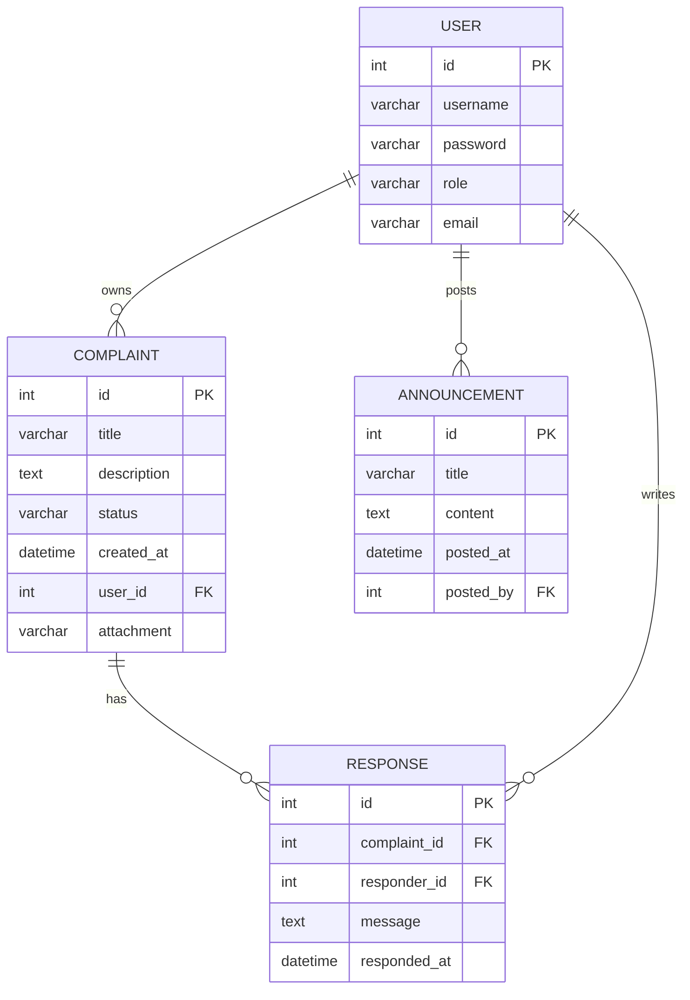
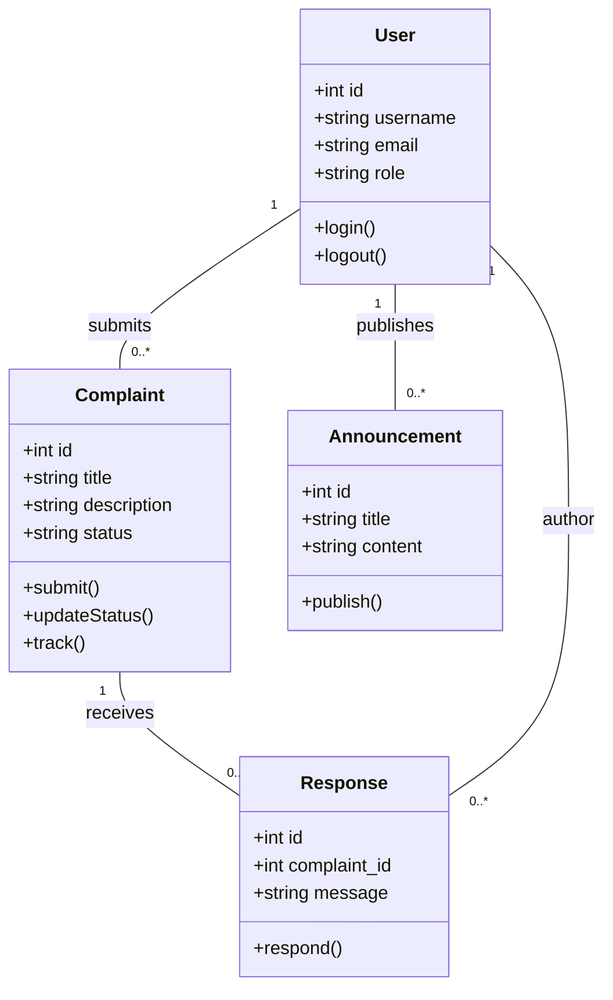

# PlaceParole Academic Report

## 1. Abstract
This report presents a formal analysis of the PlaceParole project, an integrated complaint and community reporting system. It covers system scope, requirements, architecture, data model, functional behavior, and design diagrams with an academic tone. The report also includes an ERD, Use Case, Class, and Sequence diagrams, explicitly mapped to this project’s modules and code structure.

## 2. Introduction
PlaceParole is a PHP-based community platform for submitting, tracking, and resolving complaints and suggestions. The system is designed to support multiple user roles (admin, manager, seller, citizen), ensure secure authentication, and provide workflow transparency for complaint lifecycle management.

- **Project context**: `index.php`, `modules/*`, `templates/*`, `config/*`, `integrations/*`
- **Primary objective**: Provide streamlined complaint handling and reporting with minimal manual overhead.

## 3. Problem Statement and Objectives
The project addresses:
- Lack of centralized complaint submission and tracking.
- Poor communication between citizens and municipal managers.
- Difficulty verifying complaint resolution progress.

**Objectives**:
1. Enable secure user registration/login.
2. Allow users to submit complaints and suggestions.
3. Provide administrators dashboards for analytics and community oversight.
4. Support file uploads, notifications, and status updates.

## 4. Requirements

### 4.1 Functional Requirements
- FR1: User Authentication/Role-based Access (`modules/auth/login.php`, `modules/auth/profile.php`)
- FR2: Complaint Submission (`modules/complaints/submit.php`)
- FR3: Complaint Tracking (`modules/complaints/track.php`, `modules/complaints/my_complaints.php`)
- FR4: Admin/manager Responses (`modules/complaints/respond.php`)
- FR5: Announcements and Community List (`modules/announcements/*`, `modules/community/*`)
- FR6: Real-time analytics dashboard (`modules/analytics/dashboard.php`)

### 4.2 Non-Functional Requirements
- NFR1: Data Integrity and Security (`config/db.php`, `config/csrf.php`, `config/auth_guard.php`)
- NFR2: Usability with responsive front-end (`assets/css/`, `assets/js/alpine.min.js`)
- NFR3: Maintainability with modular structure.

## 5. System Architecture
PlaceParole follows an MVC-inspired modular PHP architecture:
- **Model**: Database layer in `config/db.php` and SQL schema (`database_schema.sql`, `test_data*.sql`)
- **View**: Templates in `templates/header.php`, `templates/footer.php`, plus module-specific HTML pages.
- **Controller**: Module PHP files orchestrating request handling and responses.

The app uses:
- Flat-file routing via module pages.
- CSRF and session-based auth guards.
- Database-backed entities: users, complaints, reports, announcements.

## 6. Data Model

### 6.1 Core Entities
- `users` (roles, profile data)
- `complaints` (title, description, status, user_id, upload file)
- `responses` (admin replies, timestamps)
- `announcements`
- `community_reports`

### 6.2 ER Diagram (Mermaid)


## 7. Use Cases

### 7.1 Actors
- Visitor/Citizen
- Registered User
- Manager
- Administrator

### 7.2 Key Use Cases
1. Register and Login
2. Submit Complaint
3. Track Complaint Status
4. Respond to Complaints
5. View and Publish Announcements

### Use Case Diagram
```mermaid
usecaseDiagram
    actor Citizen
    actor Manager
    actor Admin

    Citizen --> (Register)
    Citizen --> (Login)
    Citizen --> (Submit Complaint)
    Citizen --> (Track Complaint)
    Manager --> (Login)
    Manager --> (Respond to Complaint)
    Admin --> (Login)
    Admin --> (View Dashboard)
    Admin --> (Publish Announcement)
```

## 8. Design and Class-Level Abstractions

### 8.1 Conceptual Classes
- `User` (id, role, authentication methods)
- `Complaint` (create, update status)
- `Response` (respond, timestamp)
- `Announcement` (publish, get list)
- `Notification` (email, SMS)

### Class Diagram


## 9. Sequence Flow

### Example: Complaint Submission and Response
- User logs in.
- User submits complaint.
- System stores complaint and sends notification.
- Manager views complaint and posts response.
- Complaint status updates and user notified.

### Sequence Diagram
```mermaid
sequenceDiagram
    participant User
    participant WebApp
    participant DB
    participant Manager
    participant Notifier

    User->>WebApp: POST /complaints/submit
    WebApp->>DB: INSERT complaint
    DB-->>WebApp: success
    WebApp->>Notifier: send notification
    Notifier-->>User: email/sms

    Manager->>WebApp: GET /complaints/list
    WebApp->>DB: SELECT pending complaints
    DB-->>WebApp: list
    Manager->>WebApp: POST /complaints/respond
    WebApp->>DB: INSERT response; UPDATE complaint status
    WebApp->>Notifier: send update to User
```

## 10. Implementation Mapping (Project Files)
- Authentication & roles: `modules/auth/*`, `config/auth_guard.php`
- Complaint operations: `modules/complaints/*.php`, `uploads/complaints/`
- Communication: `integrations/email_notify.php`, `integrations/sms_send.php`
- Dashboard analytics: `modules/analytics/dashboard.php`
- UI templates: `templates/header.php`, `templates/footer.php`, CSS/JS in `assets/`

## 11. Evaluation and Validation

### 11.1 Security Controls
- CSRF protection (`config/csrf.php`)
- Role guard (`config/auth_guard.php`)
- Input sanitization and prepared statements in DB layer (assumed from `db.php` patterns)

### 11.2 Quality
- Modularity supports maintainability and extension.
- Data model supports ACID integrity for complaint/responses.
- The project uses both manual and script-driven data population (`test_data*.sql`).

## 12. Conclusions
PlaceParole effectively implements a formal complaint management lifecycle. It is academically sound in its modular architecture and consistent with real-world municipal e-governance platforms. The diagrams confirm a cohesive design with clear actor responsibilities, stable entity relationships, and robust sequence orchestration.
