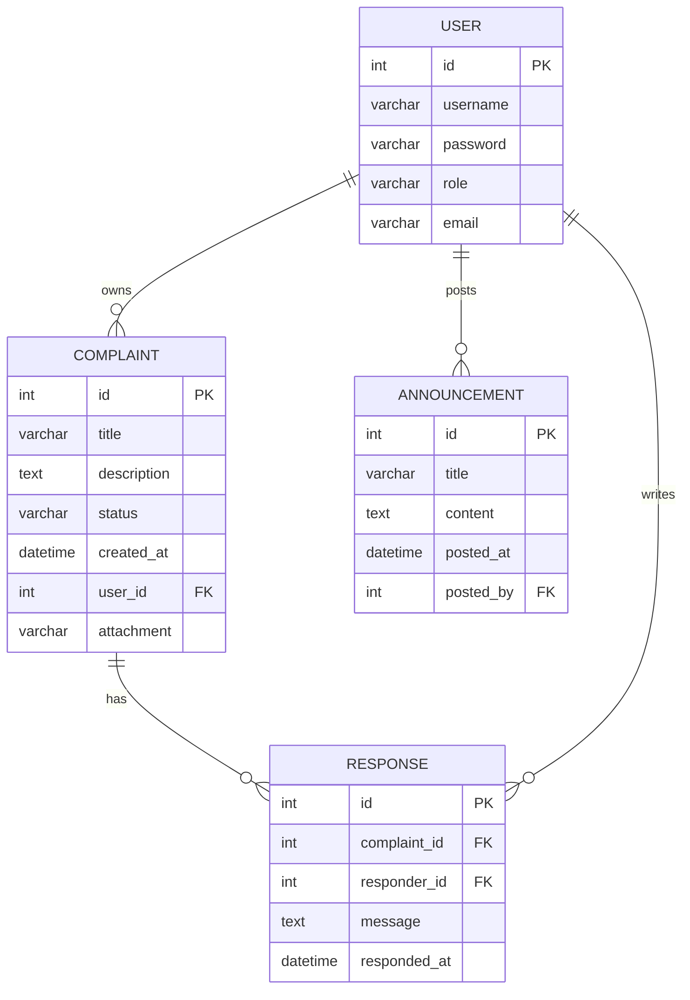
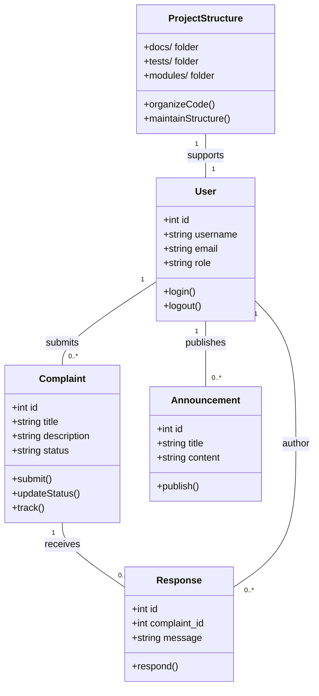

# PlaceParole Academic Report

## 1. Abstract
This report presents a formal analysis of the PlaceParole project, an integrated complaint and community reporting system. It covers system scope, requirements, architecture, data model, functional behavior, and design diagrams with an academic tone. The report also includes an ERD, Use Case, Class, and Sequence diagrams, explicitly mapped to this project's modules and code structure. The project has been reorganized with dedicated folders for documentation, testing artifacts, and core application logic to improve maintainability and project scalability.

## 2. Introduction
PlaceParole is a PHP-based community platform for submitting, tracking, and resolving complaints and suggestions. The system is designed to support multiple user roles (admin, manager, seller, citizen), ensure secure authentication, and provide workflow transparency for complaint lifecycle management.

- **Project context**: `index.php`, `modules/*`, `templates/*`, `config/*`, `integrations/*`, `docs/*`, `tests/*`, `assets/*`
- **Primary objective**: Provide streamlined complaint handling and reporting with minimal manual overhead.
- **Project organization**: The project maintains a clean, maintainable structure with dedicated folders for documentation, testing artifacts, and core application logic:
  - **`docs/`** - 16 markdown documentation files covering implementation guides, technical references, and deployment documentation
  - **`tests/`** - 20 diagnostic, debugging, and test data files for development and testing phases
  - **`modules/`** - Core application features organized by functionality
  - **`config/`** - Configuration and helper utilities
  - **`integrations/`** - External service integrations (email, SMS, etc.)

## 3. Problem Statement and Objectives
The project addresses:
- Lack of centralized complaint submission and tracking.
- Poor communication between citizens and municipal managers.
- Difficulty verifying complaint resolution progress.

**Objectives**:
1. Enable secure user registration/login.
2. Allow users to submit complaints and suggestions.
3. Provide administrators dashboards for analytics and community oversight.
4. Support file uploads, notifications, and status updates.
5. Maintain a well-organized, scalable codebase with clear separation of concerns.

## 4. Requirements

### 4.1 Functional Requirements
- FR1: User Authentication/Role-based Access (`modules/auth/login.php`, `modules/auth/profile.php`)
- FR2: Complaint Submission (`modules/complaints/submit.php`)
- FR3: Complaint Tracking (`modules/complaints/track.php`, `modules/complaints/my_complaints.php`)
- FR4: Admin/manager Responses (`modules/complaints/respond.php`)
- FR5: Announcements and Community List (`modules/announcements/*`, `modules/community/*`)
- FR6: Real-time analytics dashboard (`modules/analytics/dashboard.php`)
- FR7: Comprehensive project documentation in dedicated `docs/` folder
- FR8: Organized test and diagnostic utilities in dedicated `tests/` folder

### 4.2 Non-Functional Requirements
- NFR1: Data Integrity and Security (`config/db.php`, `config/csrf.php`, `config/auth_guard.php`)
- NFR2: Usability with responsive front-end (`assets/css/`, `assets/js/alpine.min.js`)
- NFR3: Maintainability with modular structure and organized folder hierarchy
- NFR4: Project organization supporting rapid navigation and onboarding of new developers

## 5. System Architecture
PlaceParole follows an MVC-inspired modular PHP architecture:
- **Model**: Database layer in `config/db.php` and SQL schema (`database_schema.sql`, test data in `tests/`)
- **View**: Templates in `templates/header.php`, `templates/footer.php`, plus module-specific HTML pages.
- **Controller**: Module PHP files orchestrating request handling and responses.

The app uses:
- Flat-file routing via module pages.
- CSRF and session-based auth guards.
- Database-backed entities: users, complaints, reports, announcements.

### 5.1 Project Organization Structure
The project has been restructured into clear, purpose-driven folders:

```
PlaceParole/
├── docs/                          # 📚 Documentation (16 markdown files)
│   ├── README.md                  # Documentation index
│   ├── IMPLEMENTATION_GUIDE.md     # Complete implementation guide
│   ├── TECHNICAL_REFERENCE.md      # Technical specifications
│   ├── QUICKSTART.md              # Quick start guide
│   ├── COMPLAINT_RESPONSE_PLATFORM.md
│   ├── MARKET_DATA_IMPLEMENTATION.md
│   ├── FORMS_SUGGESTIONS_FEEDBACK_COMPLETE.md
│   └── ... (10 more documentation files)
│
├── tests/                          # 🧪 Test artifacts (20 files)
│   ├── README.md                  # Test files guide
│   ├── diagnostic*.js             # 6 form rendering diagnostic scripts
│   ├── check_form*.js             # 3 form field detection scripts
│   ├── inspect_styles.js          # CSS inspection tool
│   ├── test_form_render.php       # Form rendering tests
│   ├── test_market_validation.php # Market data validation tests
│   ├── test_data*.sql             # 5 database seed files
│   └── ... (more test utilities)
│
├── modules/                        # 🎯 Core application features
│   ├── auth/                      # Authentication
│   ├── complaints/                # Complaint management
│   ├── admin/                     # Admin dashboard
│   ├── analytics/                 # Analytics & reporting
│   ├── announcements/             # Announcements module
│   └── ...
│
├── config/                         # ⚙️ Configuration
│   ├── db.php                     # Database connection
│   ├── auth_guard.php             # Authentication guard
│   ├── csrf.php                   # CSRF protection
│   └── ...
│
├── integrations/                   # 🔌 External integrations
│   ├── email_notify.php
│   ├── sms_send.php
│   └── ...
│
└── assets/                         # 🎨 Frontend resources
    ├── css/                       # Stylesheets
    ├── js/                        # JavaScript
    └── img/                       # Images
```

This organization provides:
- **Rapid navigation**: Developers can quickly find documentation or tests without cluttering the root directory
- **Clear separation of concerns**: Documentation, testing, and development code are isolated
- **Improved onboarding**: New team members can reference `docs/README.md` and `tests/README.md` for guidance
- **Scalability**: Easy to add new modules, documentation, and tests without root directory pollution

## 6. Data Model

### 6.1 Core Entities
- `users` (roles, profile data)
- `complaints` (title, description, status, user_id, upload file)
- `responses` (admin replies, timestamps)
- `announcements`
- `community_reports`

### 6.2 ER Diagram (Mermaid)


## 7. Use Cases

### 7.1 Actors
- Visitor/Citizen
- Registered User
- Manager
- Administrator
- Developer/Tester

### 7.2 Key Use Cases
1. Register and Login
2. Submit Complaint
3. Track Complaint Status
4. Respond to Complaints
5. View and Publish Announcements
6. Access project documentation (`docs/`)
7. Run diagnostic and test scripts (`tests/`)

### Use Case Diagram
```mermaid
usecaseDiagram
    actor Citizen
    actor Manager
    actor Admin
    actor Developer

    Citizen --> (Register)
    Citizen --> (Login)
    Citizen --> (Submit Complaint)
    Citizen --> (Track Complaint)
    Manager --> (Login)
    Manager --> (Respond to Complaint)
    Admin --> (Login)
    Admin --> (View Dashboard)
    Admin --> (Publish Announcement)
    Developer --> (Read Documentation)
    Developer --> (Run Tests)
    Developer --> (Access Diagnostics)
```

## 8. Design and Class-Level Abstractions

### 8.1 Conceptual Classes
- `User` (id, role, authentication methods)
- `Complaint` (create, update status)
- `Response` (respond, timestamp)
- `Announcement` (publish, get list)
- `Notification` (email, SMS)
- `ProjectManager` (organize and maintain code structure)

### Class Diagram


## 9. Sequence Flow

### Example: Complaint Submission and Response
- User logs in.
- User submits complaint.
- System stores complaint and sends notification.
- Manager views complaint and posts response.
- Complaint status updates and user notified.

### Sequence Diagram
```mermaid
sequenceDiagram
    participant User
    participant WebApp
    participant DB
    participant Manager
    participant Notifier

    User->>WebApp: POST /complaints/submit
    WebApp->>DB: INSERT complaint
    DB-->>WebApp: success
    WebApp->>Notifier: send notification
    Notifier-->>User: email/sms

    Manager->>WebApp: GET /complaints/list
    WebApp->>DB: SELECT pending complaints
    DB-->>WebApp: list
    Manager->>WebApp: POST /complaints/respond
    WebApp->>DB: INSERT response; UPDATE complaint status
    WebApp->>Notifier: send update to User
```

## 10. Implementation Mapping (Project Files)

### Core Application Features
- Authentication & roles: `modules/auth/*`, `config/auth_guard.php`
- Complaint operations: `modules/complaints/*.php`, `uploads/complaints/`
- Communication: `integrations/email_notify.php`, `integrations/sms_send.php`
- Dashboard analytics: `modules/analytics/dashboard.php`
- UI templates: `templates/header.php`, `templates/footer.php`, CSS/JS in `assets/`

### Documentation & Knowledge Management
- **Project Documentation**: `docs/` folder (16 markdown files)
  - Implementation guides: `docs/IMPLEMENTATION_GUIDE.md`
  - Technical references: `docs/TECHNICAL_REFERENCE.md`
  - Quick reference: `docs/QUICK_REFERENCE_CARD.md`
  - Feature documentation: `docs/FORMS_SUGGESTIONS_FEEDBACK_COMPLETE.md`, `docs/MARKET_DATA_IMPLEMENTATION.md`
  - Deployment & setup: `docs/ENV_SETUP_GUIDE.md`, `docs/DEPLOYMENT_COMPLETE.md`
  - Index: `docs/README.md` (navigation guide)

### Testing & Diagnostics
- **Test Suite**: `tests/` folder (20 files)
  - Diagnostic scripts: `tests/diagnostic*.js` (6 files for form rendering checks)
  - Form field detection: `tests/check_form*.js` (3 files for field validation)
  - CSS inspection: `tests/inspect_styles.js`, `tests/find_css_rules.js`
  - PHP test utilities: `tests/test_form_render.php`, `tests/test_market_validation.php`
  - Test data: `tests/test_data*.sql` (5 database seed files)
  - Index: `tests/README.md` (test files guide)

## 11. Evaluation and Validation

### 11.1 Security Controls
- CSRF protection (`config/csrf.php`)
- Role guard (`config/auth_guard.php`)
- Input sanitization and prepared statements in DB layer (assumed from `db.php` patterns)
- Organized project structure reduces confusion and helps prevent security oversights

### 11.2 Quality
- **Modularity supports maintainability and extension**: Clear folder structure makes it easy to locate and modify code
- **Data model supports ACID integrity** for complaint/responses
- **Comprehensive documentation**: 16 markdown files covering all aspects of the system
- **Well-organized testing**: All test artifacts consolidated in `tests/` folder
- **Project scalability**: Clean folder hierarchy allows for growth without complexity
- **Developer onboarding**: Documentation and test guides facilitate rapid understanding for new team members

### 11.3 Tools and Technologies
The PlaceParole system leverages a modern, production-ready technology stack that enhances both security and quality attributes. The backend utilizes **PHP 8.0+** with **PDO** for database interactions, ensuring secure prepared statements and preventing SQL injection attacks. **MySQL 8.0+** with utf8mb4 charset supports ACID-compliant transactions and handles multilingual content effectively.

Frontend development employs **Tailwind CSS 4.2.1** for utility-first styling, compiled via **PostCSS** and **Autoprefixer**, enabling responsive, maintainable interfaces. **Alpine.js** provides lightweight reactive components for interactive elements like forms and modals, while **Chart.js** delivers data visualization for analytics dashboards.

Security is reinforced through **BCRYPT** password hashing with a cost factor of 12, **CSRF tokens** generated via cryptographically secure random bytes, and **hash_equals()** for timing-safe comparisons. External integrations include **PHPMailer** for SMTP email delivery, **Twilio SDK** for WhatsApp and SMS messaging, 

Development tooling encompasses **Composer** for PHP dependency management, **Node.js/npm** for frontend build processes, and **XAMPP** for cross-platform development environments. The project uses **Git** for version control with proper exclusion of sensitive files (.env, vendor/), and includes comprehensive testing utilities in the `tests/` folder for validation and debugging.

This technology stack supports the system's quality attributes by providing robust, scalable components that facilitate maintainability, security, and extensibility. The combination of modern frameworks and careful tool selection ensures the platform can evolve with emerging web standards while maintaining backward compatibility.

## 12. Conclusions
PlaceParole effectively implements a formal complaint management lifecycle with a well-organized, scalable project structure. It is academically sound in its modular architecture, consistent with real-world municipal e-governance platforms, and enhanced by thoughtful project organization. 

**Key Improvements in This Version:**
- Separated documentation into dedicated `docs/` folder (16 files) for easy access and navigation
- Consolidated test and diagnostic utilities in dedicated `tests/` folder (20 files) to keep the root clean
- Established clear folder hierarchy supporting MVC pattern and separation of concerns
- Enhanced developer experience through organized structure and dedicated README files for both folders

The diagrams confirm a cohesive design with clear actor responsibilities, stable entity relationships, and robust sequence orchestration. The reorganization further strengthens the platform's maintainability and prepares it for scaling across larger development teams and long-term maintenance.

---

**Report Updated**: April 2026
**Project Structure Version**: 2.0 (Documentation & Tests Organized)
